# MCSA Project 
**Created by:** Eng. Mahmoud Hamed  
**Supervised by:** Eng. Mohamed Abosehly  
---
## 📚 Topics I Have Learned
### 1️⃣ Active Directory & Group Policy
- Setting up and managing the **Domain Controller (DC)**.
- Creating and configuring **Group Policies**, including:
  - Enforcing desktop background.
  - Disabling USB access.
  - Restricting access to Control Panel.

🖼️ Example Screenshots:  
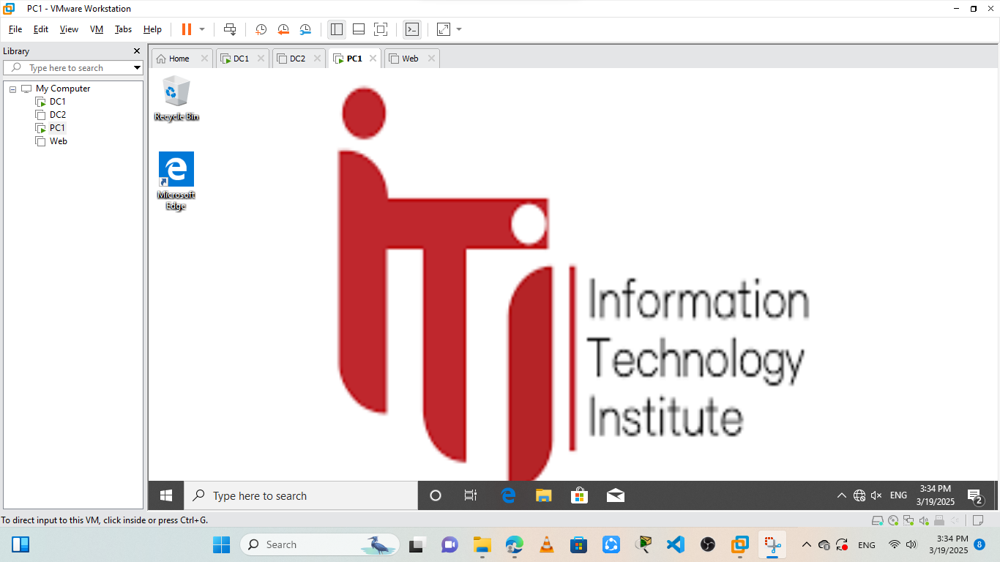  
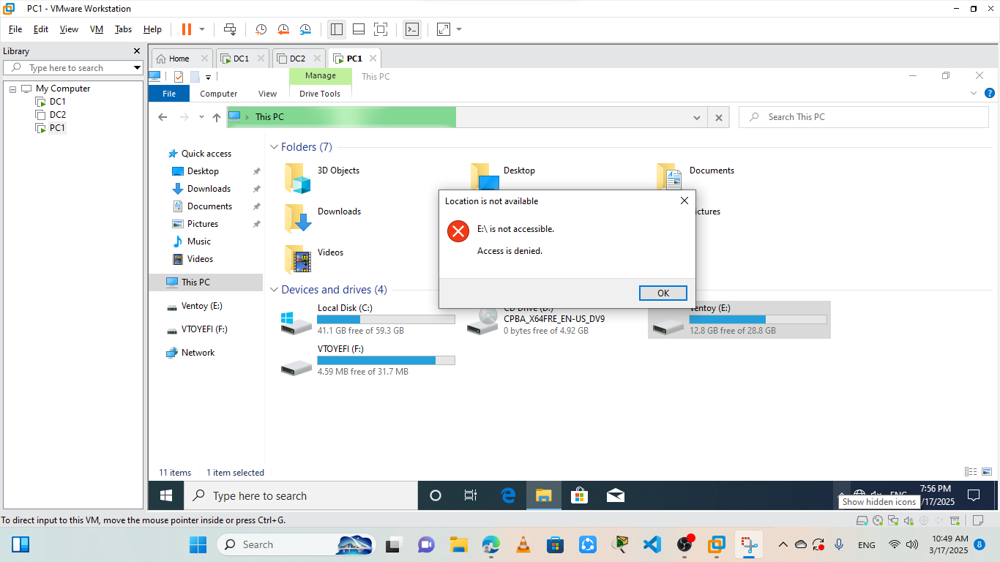  
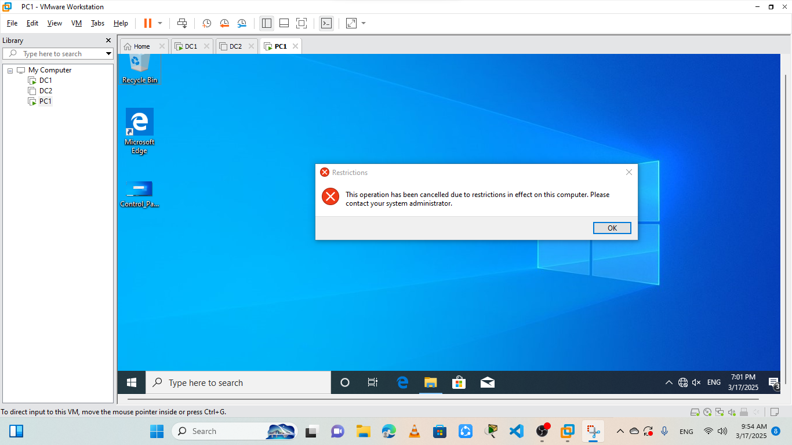

---

### 2️⃣ DNS Server
- Creating and managing **DNS Zones & Records**.
- Enabling access to the web server using domain names instead of IP.

🖼️ Example Screenshots:  
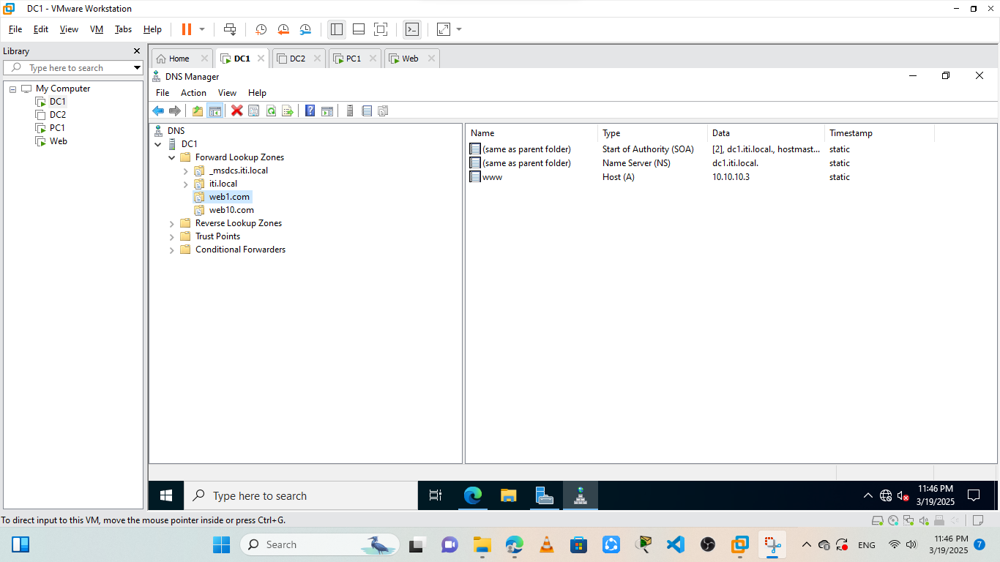  
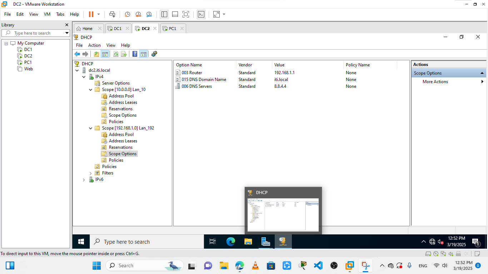

---

### 3️⃣ DHCP Server
- Configuring **DHCP Scopes** and **Reservations**.
- Setting up **failover** for high availability.
- Replicating scopes between primary and standby servers.
- Backing up and restoring DHCP settings.

🖼️ Example Screenshots:  
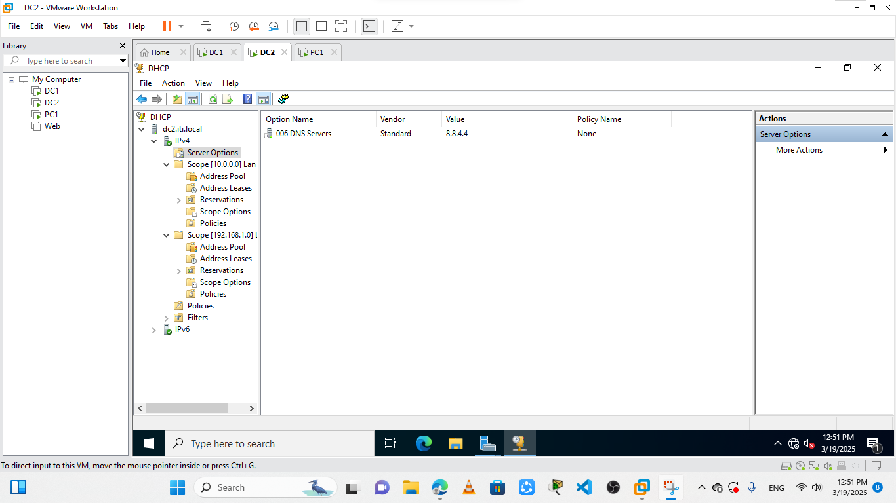  
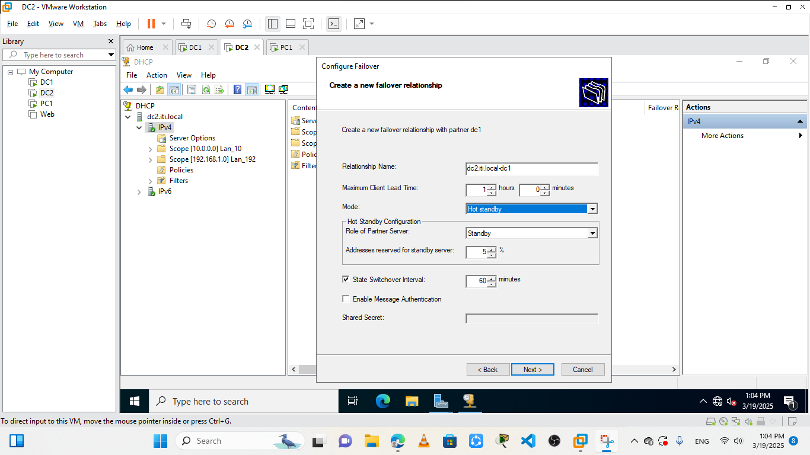  
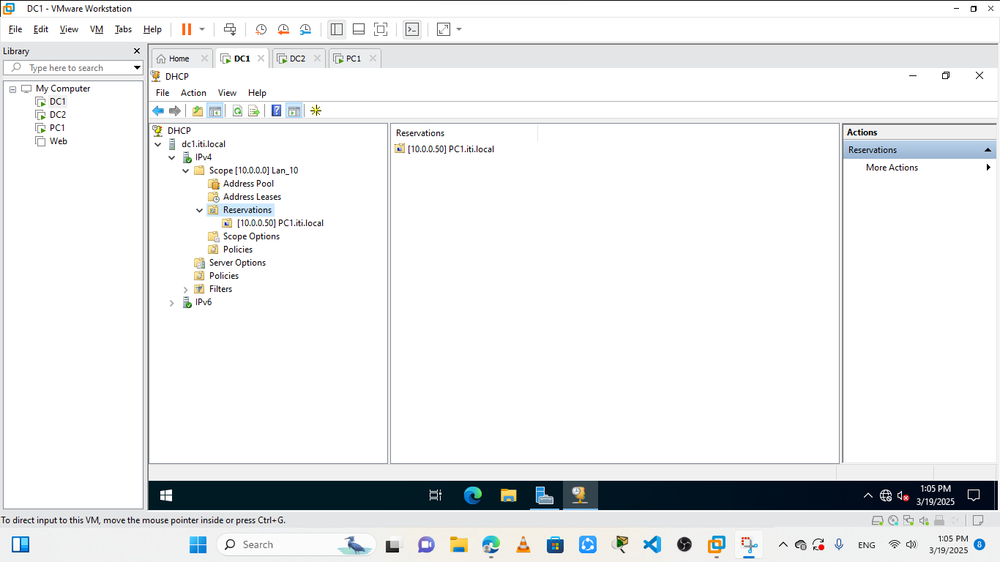
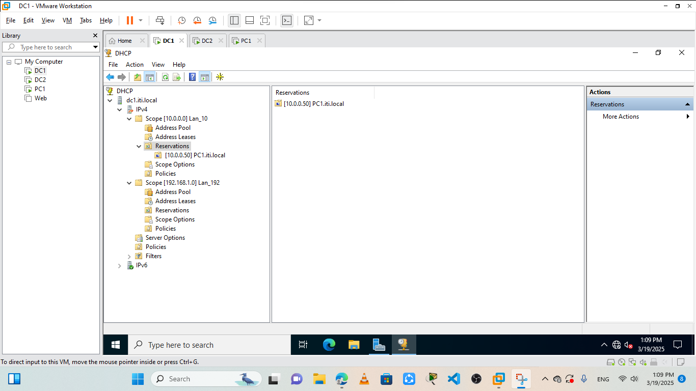

---

### 4️⃣ IIS & FTP Server
- Setting up **IIS** for web hosting.
- Configuring **FTP Server** for specific users.

🖼️ Example Screenshots:  
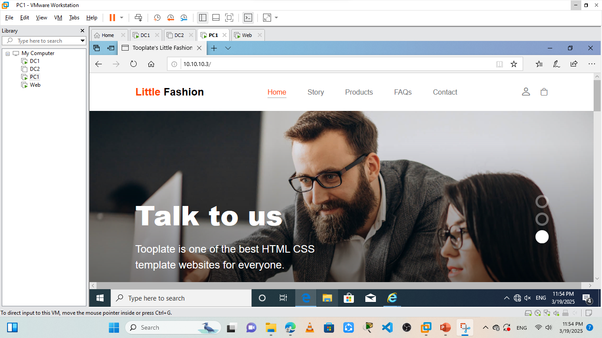  
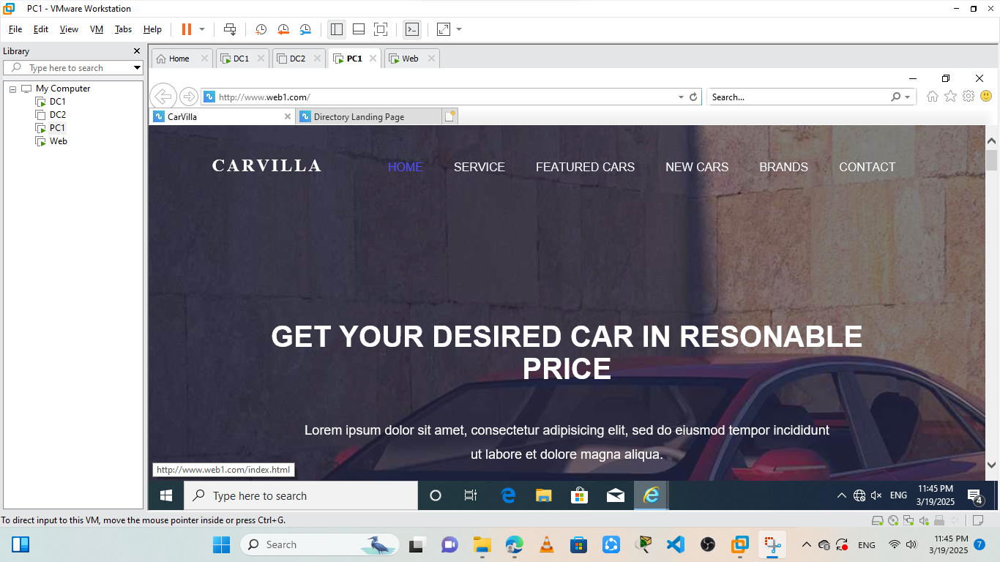
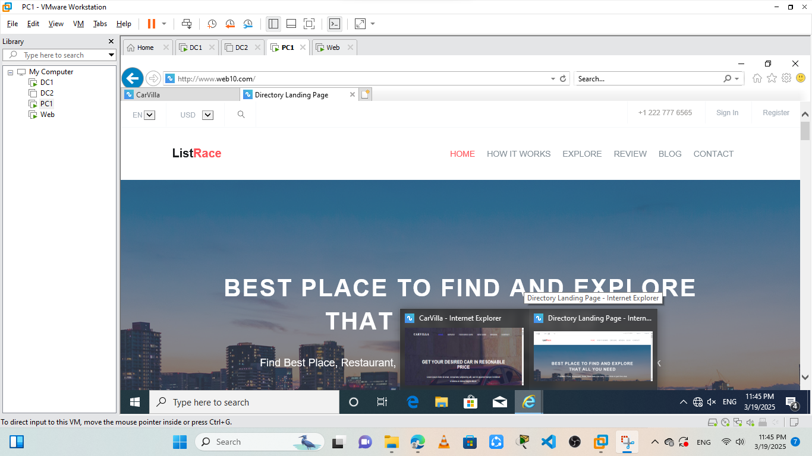

---

### 5️⃣ Storage Management

#### ▪ Basic vs. Dynamic Storage:
- **Basic:** Uses primary/extended partitions.
- **Dynamic:** Supports volumes: Simple, Spanned, Striped (RAID 0), Mirrored (RAID 1), RAID 5.

#### ▪ File System Formats:
| Format  | Details                              |
|---------|--------------------------------------|
| FAT32   | Max file size 4GB                    |
| NTFS    | Supports permissions & encryption    |
| exFAT   | Best for flash drives, no size limit |

#### ▪ MBR vs. GPT:
| Feature             | MBR            | GPT                 |
|---------------------|----------------|---------------------|
| Max Partition Size  | 2 TB           | 10 ZB               |
| Max Partitions      | 4 Primary      | Up to 128 Partitions|
| Boot Mode           | Legacy BIOS    | UEFI                |

#### ▪ Mounting Volumes:
Mount volumes to folders when drive letters run out.

🖼️ Example Screenshots:  

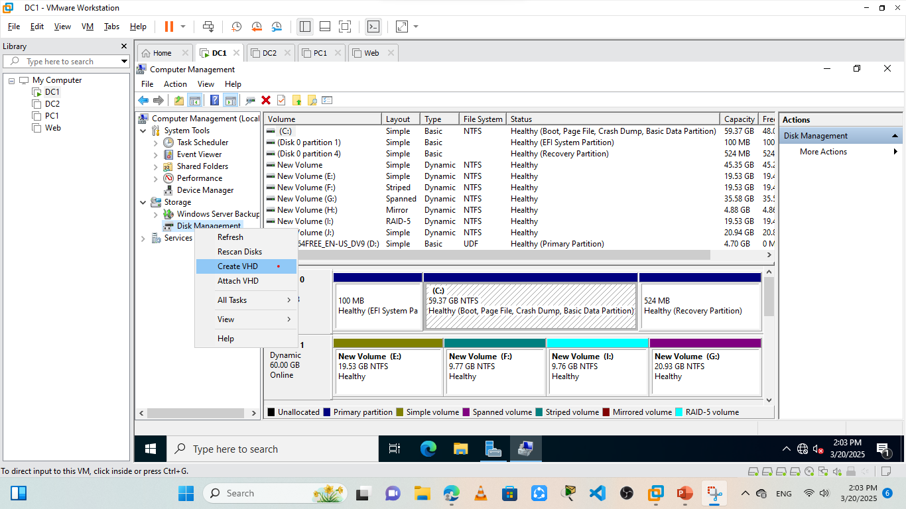
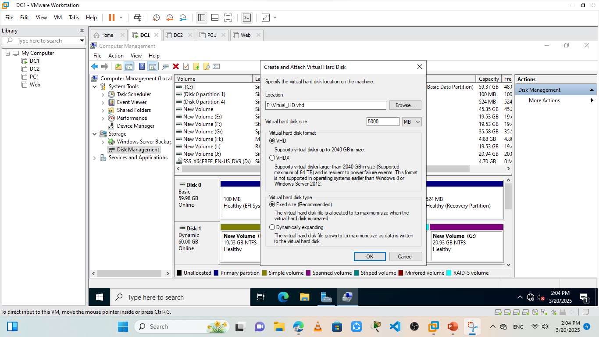
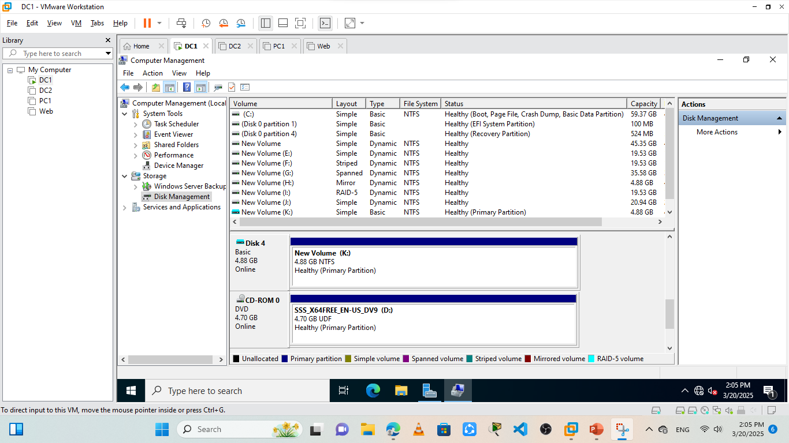

---

### 6️⃣ RAID & VHD (Virtual Hard Disk)
- Creating **RAID arrays** for redundancy.
- Working with **Virtual Hard Disks (VHD)** for storage flexibility.

🖼️ Example Screenshots:    
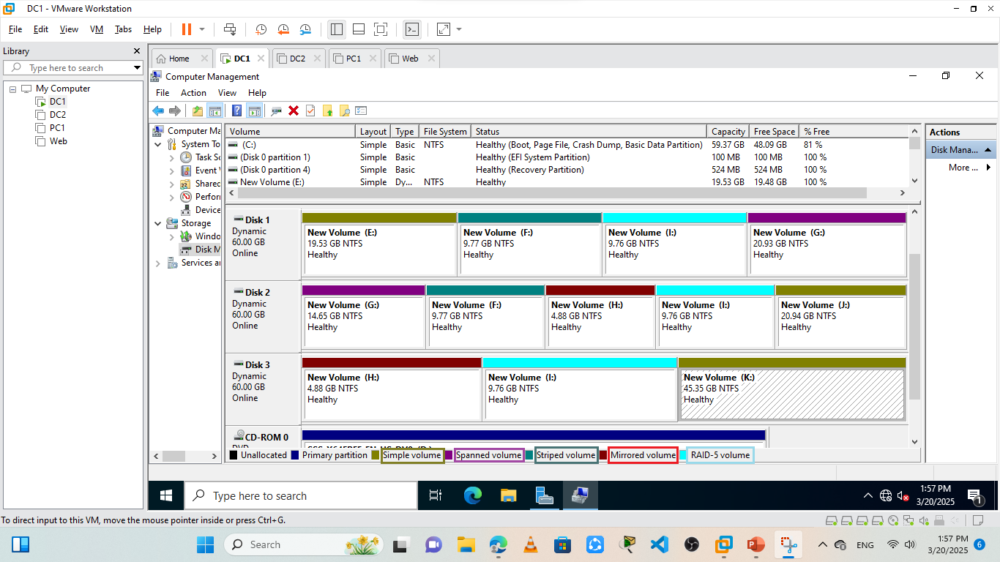
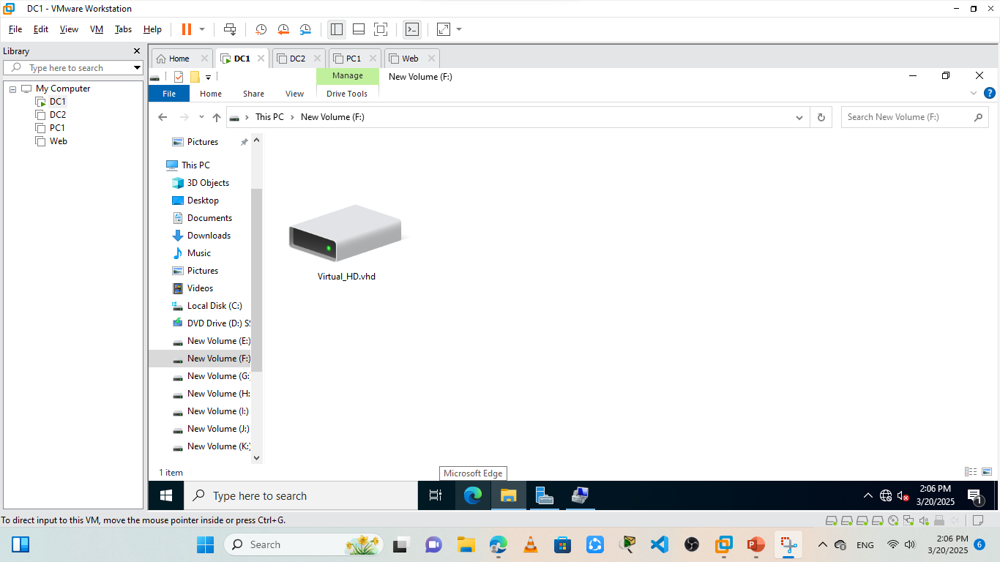

---

## 🗂️ File List Summary (Slides)
- Slide 1–5: Introduction & Setup
- Slide 6–11: Group Policy Examples
- Slide 12–18: DHCP Setup & Failover
- Slide 19–22: RAID, Mounting, and VHD

---

## 🔗 Repository Media
> You can find all related screenshots and files in the `images/` folder in this repository.
